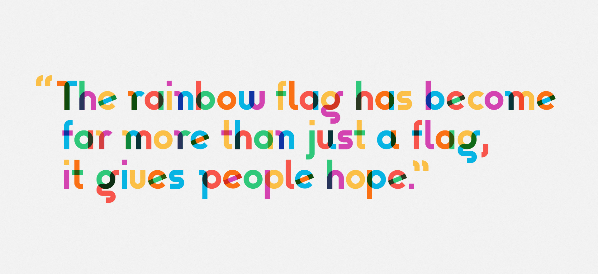

# Type With Pride: The Gilbert Font Project

On 31 March, 2017, Gilbert Baker the creator of the iconic Rainbow Flag sadly passed away. Mr. Baker was both an LGBTQ activist and artist, and was known for helping friends create banners for protests and marches. To honor the memory of Gilbert Baker, NewFest and NYC Pride partnered with Ogilvy & Mather and Fontself to create free fonts inspired by the design language of the iconic Rainbow Flag, the typeface was named *Gilbert* after Mr. Baker.

- Learn more about Type With Pride at [typewithpride.com](https://www.typewithpride.com)
- Learn more about the ongoing creative and technical process on the Fontself blog (coming soon!)

## Specimen

## Details

### [Download the fonts](https://github.com/Fontself/TypeWithPride/releases/download/1.001/Gilbert_1.001_alpha.zip) · [How to install](/documentation)

*Gilbert* is available today as preview alpha version in the OpenType font format and will grow over the upcoming months into a font family with several weights, stylistic sets, ligatures and symbols.

*Gilbert Color* features colorful glyphs and is currently available in the OpenType-SVG color font format.

- [Check out the docs](/documentation) to learn more about how to use the *Gilbert* font and its color version.
- [Check out ColorFonts.WTF](https://www.colorfonts.wtf) to learn more about color fonts and their technical specificities.

*Gilbert* was made with a custom version of [Fontself for Illustrator](https://www.fontself.com), based on a typeface design created in [Adobe Illustrator](https://www.adobe.com/illustrator). The font sources will be freely available at a later stage.

## License

Thanks to support from the Type With Pride authors, NewFest, NYC Pride and Fontself, all Type With Pride artwork and the Gilbert font are released under the Creative Commons Attribution-ShareAlike 4.0 International License. Learn more about this license and usage rights at <http://creativecommons.org/licenses/by-sa/4.0/>

- Learn more about NewFest at [newfest.org](http://www.newfest.org)
- Learn more about NYC Pride at [nycpride.org](https://www.nycpride.org)
- Learn more about Fontself at [fontself.com](https://www.fontself.com)

## Repository Layout

The font repository follows the Unified Font Repository v2.0, a standard way to organize font project source files. 

- Learn more at <https://github.com/raphaelbastide/Unified-Font-Repository>
