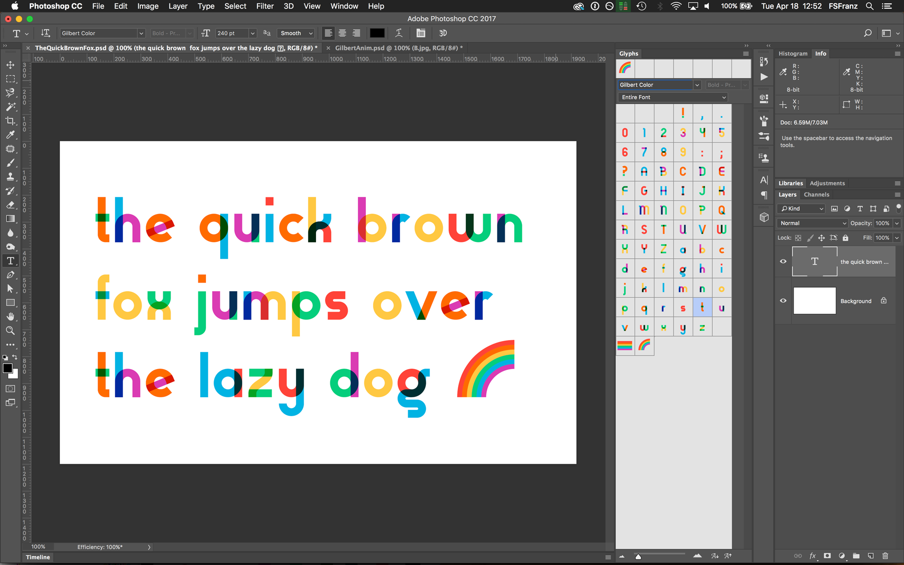

# Gilbert usage guide

This font family is part of an ongoing project, Type With Pride. Get the latest versions of the free font files at typewithpride.com

*Gilbert* can be installed and used in most apps and operating systems, like any other standard OpenType font file.

*Gilbert Color* can also be installed on both Mac & PC but it will be displayed only in a few apps since it relies on a new color font format, [OpenType-SVG](https://www.microsoft.com/typography/otspec/svg.htm). Color fonts are currently supported by [a couple browsers](http://stateofwebtype.com/#OpenType-SVG) (Firefox and Microsoft Edge) and [more recently](https://blogs.adobe.com/creativecloud/photoshop-cc-adds-support-for-opentype%E2%88%92svg-fonts-an-in-depth-look/) at least by one creative app (Photoshop CC 2017).

Yet no operating system already support color fonts.

The good news is you can include a fallback version within the same font file: a color font file may then also include a standard "black" font to ensure anyone can see the shapes of the typeface, whatever color font support they have.

Gilbert Color includes such a fallback solution, so when you install Gilbert Color on your computer, it will simply show up as a black font. Don't panic, the color font data is still around: just load Photoshop CC 2017 and you will see the color font:

You can try it by yourself by loading the sample Photoshop PSD file, TheQuickBrownFox.psd (remember, Photoshop CC 2017 is required)

FYI, many other software, browser and operating system makers are interested to support color fonts, so you can expect to be able to use Gilbert Color in many more apps soon ;) 

- Visit Adobe's help page to learn more about Photoshop's support: https://helpx.adobe.com/typekit/using/ot-svg-color-fonts.html
- Check Fontself’s dedicated resource to learn more about color fonts: www.colorfonts.wtf 
- And read this great article on the evolution of chromatic type: http://ilovetypography.com/2017/04/03/the-evolution-of-chromatic-fonts
